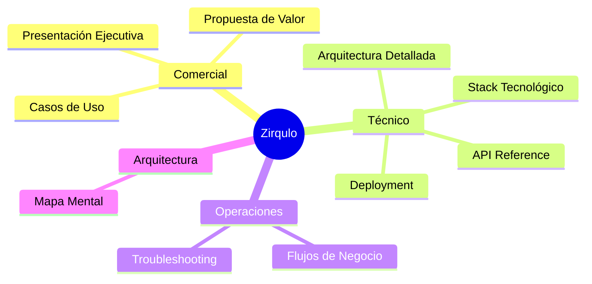

# Zirqulo — Documentación Completa

> **Plataforma Multi-Tenant para la Compra y Valoración de Dispositivos Móviles**
>
> Un ecosistema completo que conecta partners, clientes y dispositivos a través de una solución tecnológica integral.

---

## 🗺️ Navegación Rápida

---

## 📋 Estructura de Documentación

### [[01-Mapa-Mental/Arquitectura-Zirqulo|🧠 Mapa Mental]]
Visualización completa de la arquitectura de la plataforma.

**Contenido:**
- Diagrama de componentes Frontend → Backend → BD
- Flujo multi-tenant
- Sistema de autenticación y permisos
- Integraciones externas

> [!tip] Ideal para...
> Presentaciones técnicas, onboarding de desarrolladores, y explicar la arquitectura de un vistazo.

---

### 02-Comercial/ — Documentación de Negocio

#### [[02-Comercial/Presentacion-Ejecutiva|📊 Presentación Ejecutiva]]
**Guionizada para presentar a stakeholders y partners potenciales**

- ⏱️ Elevator pitch (30 segundos)
- 🎯 Problema que resuelve
- 💎 Propuesta de valor única
- 📈 Mercado objetivo y ventajas competitivas
- 📊 Casos de éxito y métricas
- 🚀 Call to action

#### [[02-Comercial/Propuesta-Valor|💰 Propuesta de Valor]]
**Beneficios tangibles por rol y tipo de partner**

- Beneficios por tipo de usuario (Manager, Empleado, Admin)
- ROI esperado y reducción de costes
- Mejora en eficiencia operativa
- Cumplimiento legal y RGPD
- Ventajas competitivas

#### [[02-Comercial/Casos-Uso|🎬 Casos de Uso]]
**Escenarios prácticos de implementación**

- Partner B2B (empresas)
- Partner B2C (particulares)
- Operaciones globales multi-tenant
- Flujos completos con ejemplos reales

> [!info] Audiencia
> Directores de tecnología, responsables de operaciones, partners potenciales, inversores.

---

### 03-Tecnico/ — Documentación Técnica

#### [[03-Tecnico/Arquitectura-Detallada|🏗️ Arquitectura Detallada]]
**Diseño técnico completo de la plataforma**

- Diagramas de arquitectura (Mermaid)
- Separación multi-tenant (schemas PostgreSQL)
- Flujo de datos y comunicación
- WebSocket y tiempo real
- Sistema de caching y optimización
- Seguridad y cifrado

#### [[03-Tecnico/API-Reference|🔌 API Reference]]
**Referencia completa de endpoints (200+)**

- Autenticación y JWT
- Multi-tenant headers
- Endpoints por categoría
- Ejemplos de uso
- Códigos de error
- Paginación y filtros

#### [[03-Tecnico/Stack-Tecnologico|⚙️ Stack Tecnológico]]
**Tecnologías y justificación de decisiones**

- **Frontend**: Next.js 15, React 19, MUI 7, TanStack Query
- **Backend**: Django 5, DRF, Channels
- **Base de datos**: PostgreSQL + Redis
- **Testing**: Jest, RTL, 99+ tests
- Justificación de cada elección tecnológica

#### [[03-Tecnico/Deployment|🚀 Deployment]]
**Guía completa de despliegue**

- Requisitos del sistema
- Variables de entorno
- Configuración PM2
- Nginx/reverse proxy
- Comandos de despliegue
- Troubleshooting de producción

> [!warning] Nivel Técnico
> Requiere conocimientos de desarrollo full-stack, arquitectura multi-tenant, y DevOps.

---

### 04-Operaciones/ — Flujos y Mantenimiento

#### [[04-Operaciones/Flujos-Negocio|🔄 Flujos de Negocio]]
**Procesos operativos paso a paso**

- Creación de oportunidad
- Valoración de dispositivos
- Gestión de contratos B2C
- Pipeline de estados (22 estados canónicos)
- Gestión de pagos y comisiones
- Flujo de logística

#### [[04-Operaciones/Troubleshooting|🛠️ Troubleshooting]]
**Solución de problemas comunes**

- Errores de autenticación
- Problemas de multi-tenant
- Issues de WebSocket
- Problemas de performance
- Recuperación de datos
- Logs y monitoreo

> [!tip] Para...
> Equipos de soporte, administradores de sistema, y equipos operativos.

---

## 📚 Documentación Complementaria

### Archivos Consolidados

Los siguientes archivos han sido integrados en la estructura de Obsidian:

- **[[docs/proyect|Proyecto Original]]** — Documento inicial de Zirqulo
- **[[docs/proyect-overview|Project Overview v2]]** — Visión detallada del proyecto
- **[[docs/Api_Endpoints|API Endpoints]]** — Referencia completa de APIs
- **[[README|README Principal]]** — Guía de inicio rápido
- **[[tenant-frontend/TESTING|Testing Guide]]** — Estrategia de testing completa
- **[[SEGURIDAD|Seguridad]]** — Guía de seguridad para partners
- **[[PROTECCION_DATOS|Protección de Datos]]** — Cumplimiento RGPD y LOPDGDD
- **[[PM2|PM2 Deployment]]** — Guía de gestión de procesos
- **[[docs/implementacion|Plan de Implementación]]** — Roadmap técnico
- **[[docs/componentes|Catálogo de Componentes]]** — Componentes Frontend

> [!note] Ubicación
> Estos archivos están referenciados desde la nueva estructura, pero se mantienen en sus ubicaciones originales por compatibilidad.

---

## 🎯 Guías por Audiencia

### Para Directivos y Stakeholders
1. Leer [[02-Comercial/Presentacion-Ejecutiva|Presentación Ejecutiva]]
2. Revisar [[02-Comercial/Propuesta-Valor|Propuesta de Valor]]
3. Explorar [[02-Comercial/Casos-Uso|Casos de Uso]]

### Para Equipos Técnicos
1. Estudiar [[01-Mapa-Mental/Arquitectura-Zirqulo|Mapa Mental]]
2. Profundizar en [[03-Tecnico/Arquitectura-Detallada|Arquitectura Detallada]]
3. Consultar [[03-Tecnico/API-Reference|API Reference]]
4. Revisar [[03-Tecnico/Stack-Tecnologico|Stack Tecnológico]]

### Para Equipos de Operaciones
1. Comprender [[04-Operaciones/Flujos-Negocio|Flujos de Negocio]]
2. Tener a mano [[04-Operaciones/Troubleshooting|Troubleshooting]]
3. Revisar [[SEGURIDAD|Guía de Seguridad]]

### Para Nuevos Partners
1. [[02-Comercial/Presentacion-Ejecutiva|Presentación Ejecutiva]]
2. [[PROTECCION_DATOS|Protección de Datos]]
3. [[04-Operaciones/Flujos-Negocio|Flujos de Negocio]]

---

## 🔍 Búsqueda por Tags

- `#comercial` — Documentación de negocio
- `#tecnico` — Documentación técnica
- `#arquitectura` — Arquitectura y diseño
- `#api` — Referencias de API
- `#operaciones` — Flujos operativos
- `#seguridad` — Seguridad y protección de datos
- `#deployment` — Despliegue y configuración
- `#testing` — Testing y QA
- `#multi-tenant` — Multi-tenant específico

---

## 📊 Métricas Clave del Proyecto

| Métrica | Valor |
|---------|-------|
| **Endpoints API** | 200+ |
| **Tests Automatizados** | 99+ (API) + 70+ (Frontend) |
| **Estados de Oportunidad** | 22 canónicos |
| **Tecnologías** | Next.js 15, Django 5, PostgreSQL |
| **Testing Coverage** | 99 tests API + 70+ tests frontend |
| **Tipo de Arquitectura** | Multi-tenant con schemas separados |

---

## 🆕 Actualizaciones Recientes

### 2024 — Optimizaciones de Dashboard
- Integración MUI DatePicker
- Consistencia UI mejorada
- Estandarización de componentes

### 2024 — Infraestructura de Testing Completa
- Suite completa de tests (170+ tests)
- Estrategia por niveles (Tier 1, Tier 2, Health)
- Arquitectura de mocks avanzada

### 2024 — Sistema de Seguridad GeoLite2
- Detección de logins sospechosos
- Bloqueo de viajes imposibles
- Historial de ubicaciones

---

## 🤝 Contribución

Para contribuir a esta documentación:

1. Mantener formato Obsidian (YAML frontmatter, enlaces internos)
2. Usar tags apropiados
3. Incluir diagramas Mermaid donde sea posible
4. Seguir la estructura de carpetas establecida
5. Actualizar este índice al crear nuevos documentos

---

## 📞 Contacto y Soporte

- **Documentación Técnica**: Ver [[CLAUDE|CLAUDE.md]]
- **Soporte**: soporte@checkouters.com
- **Incidentes de Seguridad**: incidentes@zirqulo.com

---

**Checkouters Partners (Zirqulo)** — La plataforma integral para la gestión de dispositivos móviles y partners.

> Última actualización: 2025-10-04
