# Arquitectura Zirqulo — Mapa Mental Visual

> **Visualización completa de la plataforma multi-tenant para recompra de dispositivos**
>
> Este documento presenta la arquitectura de Zirqulo de forma visual, usando diagramas Mermaid para facilitar la comprensión del sistema completo.

---

## 🎯 Visión General

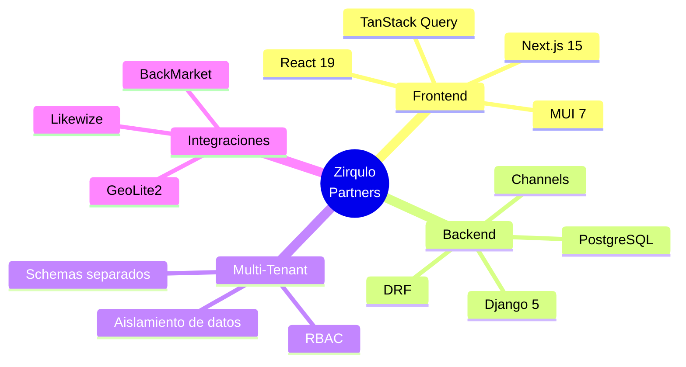

---

## 🏗️ Arquitectura de Alto Nivel

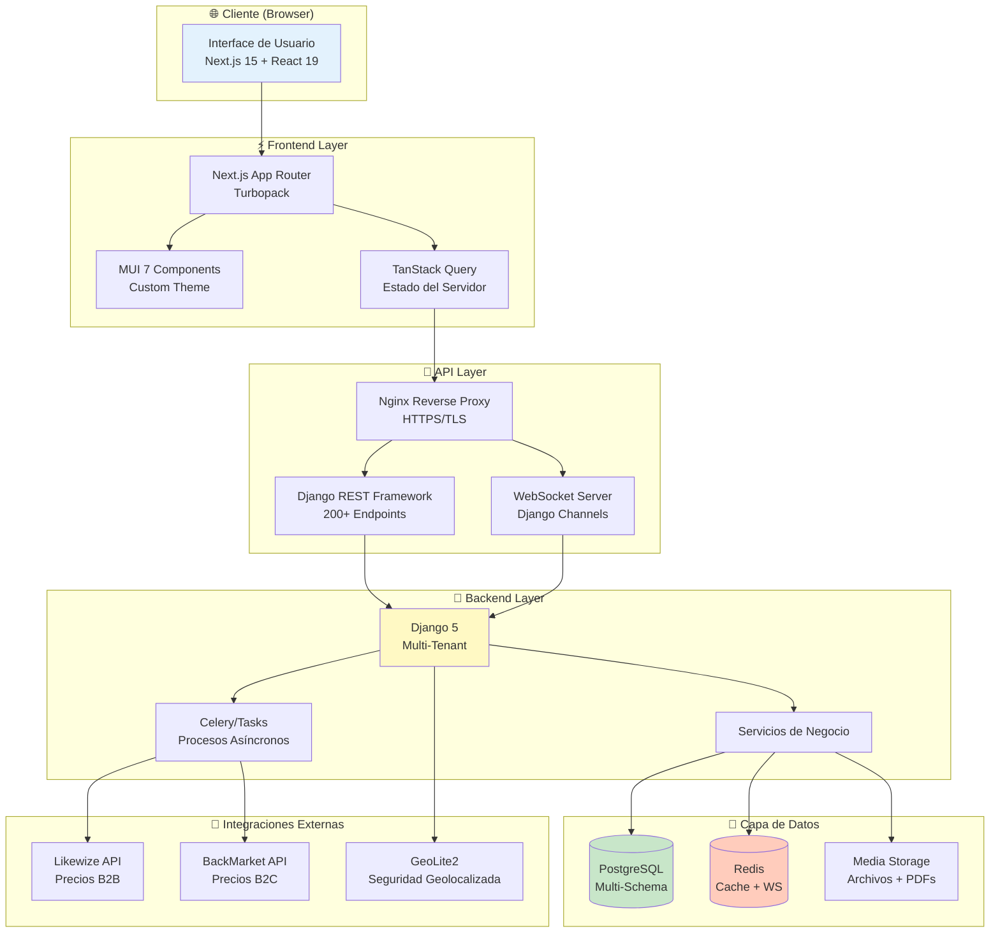

---

## 🏢 Arquitectura Multi-Tenant

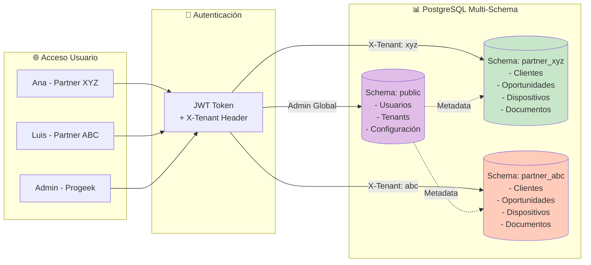

> [!info] Separación Física
> Cada partner tiene un schema completamente aislado en PostgreSQL. Es **imposible** el acceso cruzado entre partners a nivel de base de datos.

---

## 🔄 Flujo de Autenticación

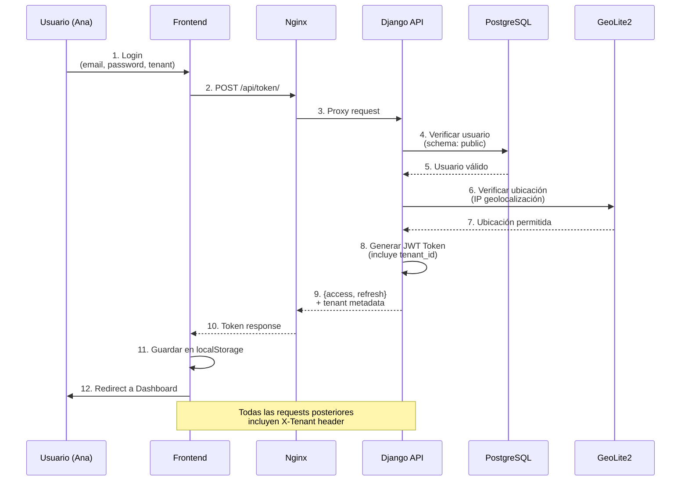

---

## 📱 Flujo Completo de Oportunidad

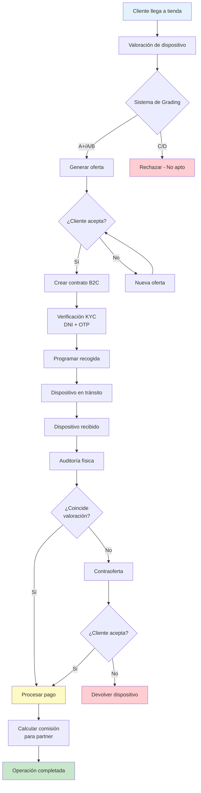

---

## 🔐 Sistema de Permisos (RBAC)

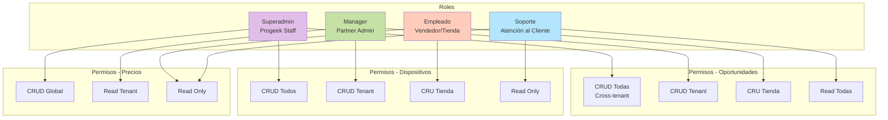

---

## 💰 Pipeline de Precios

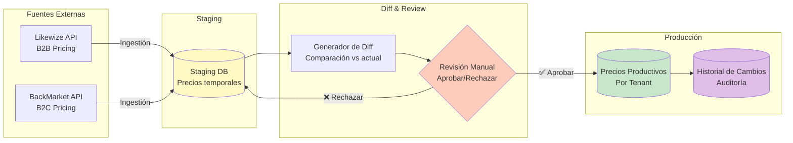

> [!tip] Trazabilidad Total
> Cada cambio de precios queda registrado con timestamp, usuario, y diff completo para auditoría.

---

## 💬 Sistema de Chat en Tiempo Real

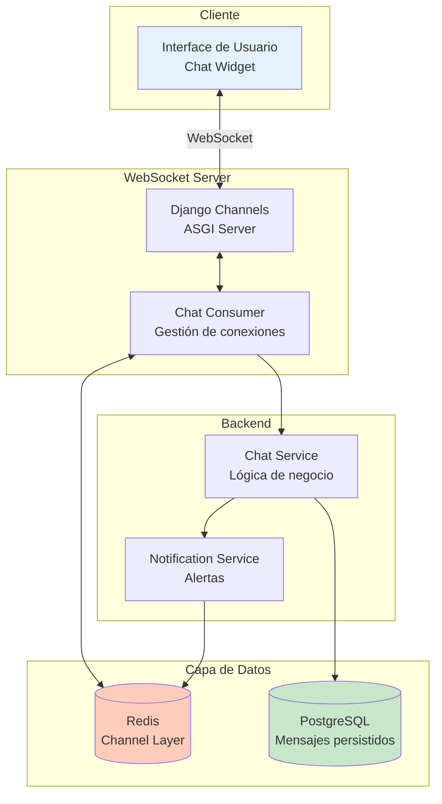

---

## 🧪 Arquitectura de Testing

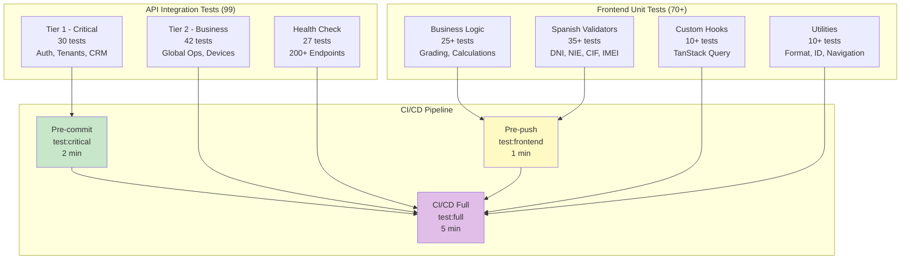

---

## 🔒 Seguridad Multi-Capa

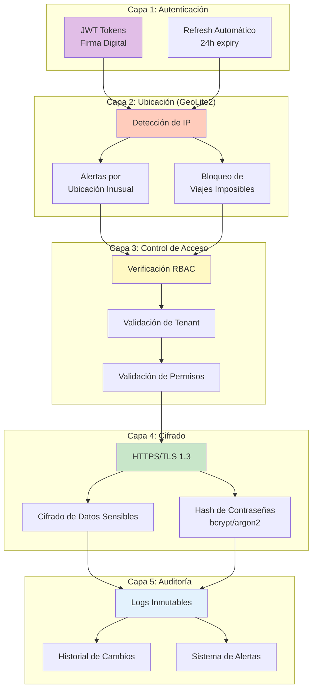

---

## 📊 Stack Tecnológico Completo

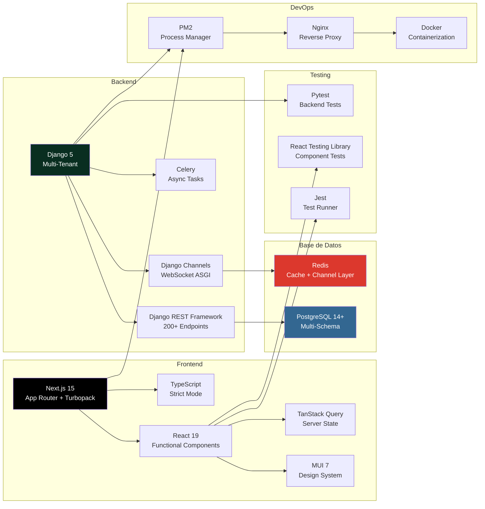

---

## 🔄 Ciclo de Vida de Datos

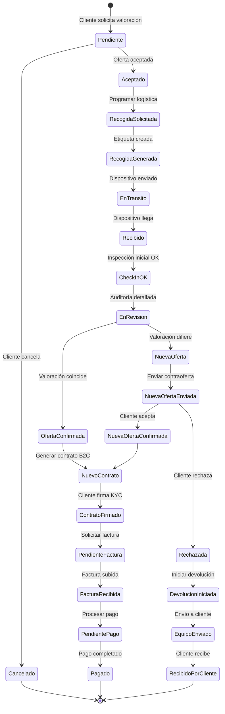

---

## 📈 KPIs y Data Contracts

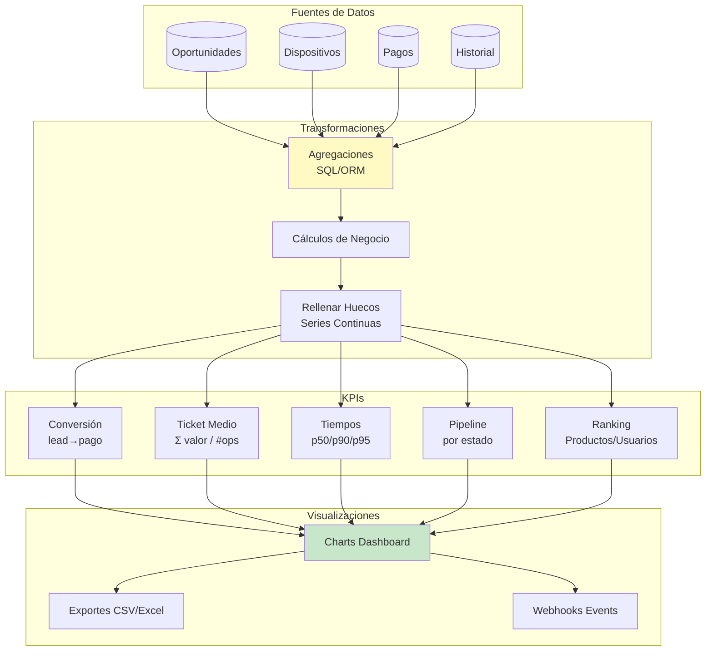

---

## 🌍 Integraciones Externas

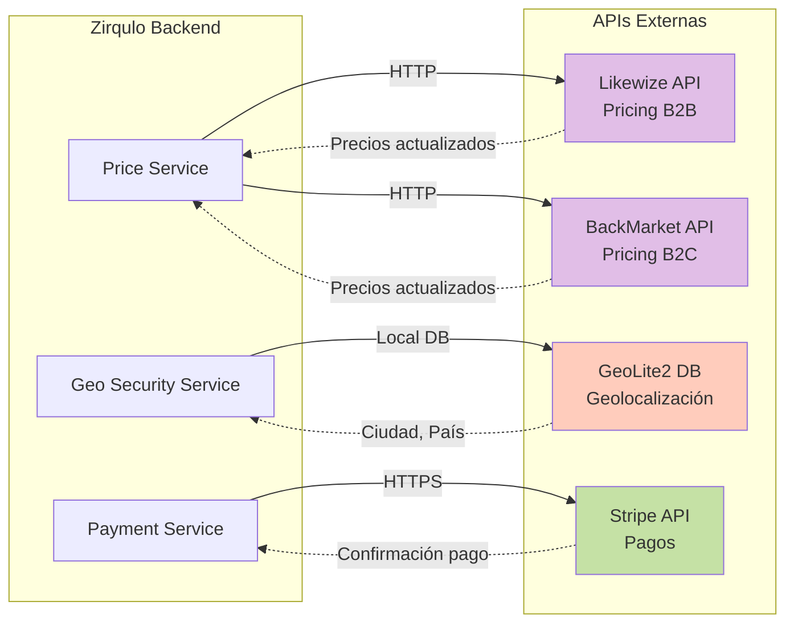

---

## 🎯 Componentes Frontend Clave

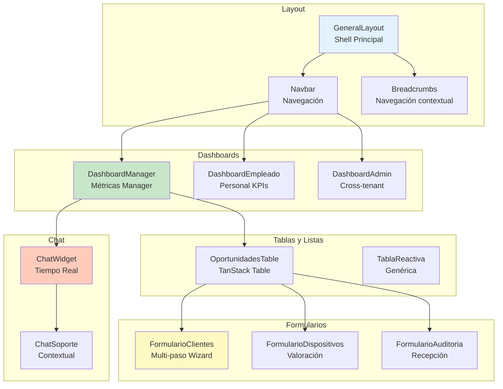

---

## 🗄️ Modelo de Datos Simplificado

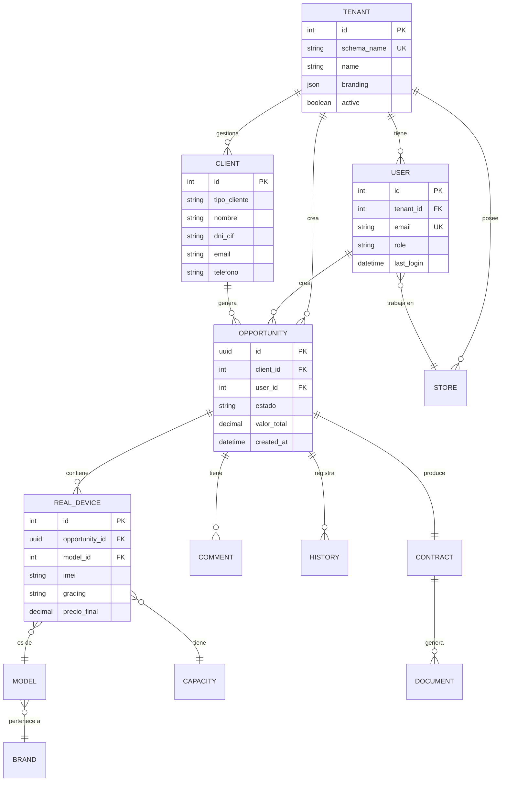

---

## 🚀 Flujo de Deployment

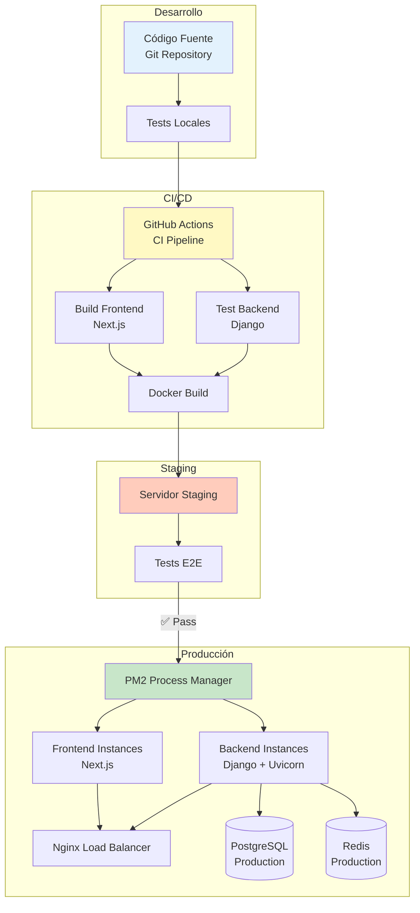

---

## 📚 Referencias Adicionales

- [[../00-Indice|← Volver al Índice]]
- [[../03-Tecnico/Arquitectura-Detallada|Arquitectura Detallada]] — Profundización técnica
- [[../03-Tecnico/Stack-Tecnologico|Stack Tecnológico]] — Justificación de tecnologías
- [[../02-Comercial/Presentacion-Ejecutiva|Presentación Ejecutiva]] — Para stakeholders

---

> [!success] Arquitectura Escalable
> Esta arquitectura está diseñada para soportar cientos de partners con millones de operaciones, manteniendo aislamiento total de datos y rendimiento óptimo.

---

**Zirqulo Partners** — Arquitectura multi-tenant para recompra de dispositivos
