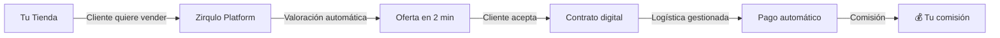

# Zirqulo — Presentación Ejecutiva

> **Plataforma Multi-Tenant para Partners de Recompra de Dispositivos**
>
> Transformamos la recompra de dispositivos móviles en un negocio rentable, escalable y transparente.

---

## 🎯 Elevator Pitch (30 segundos)

**"Zirqulo es la plataforma tecnológica que permite a retailers y cadenas convertir la recompra de dispositivos móviles usados en un canal de ingresos predecible y escalable, sin inversión en infraestructura técnica ni logística."**

**En otras palabras:**
- Tú traes clientes que quieren vender sus dispositivos
- Nosotros ponemos la tecnología, los precios y la logística
- Tú recibes comisiones automáticamente por cada operación

---

## 📊 DIAPOSITIVA 1: El Problema

### 🔴 El Mercado de Recompra es Complejo y Fragmentado

**Para retailers tradicionales (nuestros partners):**

```
❌ PROBLEMA 1: Precios Inconsistentes
   "¿Cuánto vale realmente un iPhone 13 Pro usado?"
   → Los precios cambian semanalmente según mercado B2B/B2C
   → Competidores ofrecen más o menos sin criterio claro
   → Riesgo de pérdida si valoramos mal

❌ PROBLEMA 2: Procesos Manuales
   "Cada venta requiere 10 pasos diferentes"
   → Crear oferta manual
   → Firmar contrato en papel
   → Coordinar logística
   → Gestionar pago
   → Facturación
   → Seguimiento de cada caso

❌ PROBLEMA 3: Poca Visibilidad
   "No sabemos qué está pasando en cada tienda"
   → ¿Cuántas operaciones hicimos este mes?
   → ¿Qué productos se están vendiendo más?
   → ¿Cuál es nuestra conversión?
   → ¿Estamos cumpliendo objetivos?

❌ PROBLEMA 4: Riesgo Legal
   "¿Cumplimos con RGPD? ¿Está bien firmado el contrato?"
   → Contratos en papel sin trazabilidad
   → Datos de clientes en Excel sin protección
   → Riesgo de sanciones por incumplimiento
```

**Resultado:** Oportunidades perdidas, márgenes bajos, operación ineficiente.

---

## 💡 DIAPOSITIVA 2: Nuestra Solución

### ✅ Zirqulo: La Plataforma Todo-en-Uno



**¿Qué hace Zirqulo por ti?**

1. **Valoración Instantánea**
   - Precios actualizados diariamente desde fuentes B2B/B2C
   - Sistema de grading automático (A+, A, B, C, D)
   - Oferta generada en menos de 2 minutos

2. **Contratos Digitales con Firma Electrónica**
   - Generación automática de contrato B2C
   - Firma electrónica con OTP (validación por SMS)
   - 100% válido legalmente (eIDAS ready)
   - Trazabilidad completa (IP, timestamp, hash del documento)

3. **Logística Integrada**
   - Generación de etiquetas de envío
   - Tracking en tiempo real
   - Notificaciones automáticas a cliente

4. **Gestión de Pagos**
   - Procesamiento automático de pagos
   - Cálculo automático de tu comisión
   - Facturación integrada

5. **Dashboards en Tiempo Real**
   - Métricas de conversión
   - Ranking de productos
   - Performance por tienda y vendedor
   - Objetivos vs resultados

---

## 🎁 DIAPOSITIVA 3: Propuesta de Valor Única

### ¿Por Qué Zirqulo vs Alternativas?

| Característica | Zirqulo | Competencia Tradicional |
|----------------|---------|-------------------------|
| **White-Label** | ✅ Tu marca, tus colores | ❌ Marca genérica |
| **Multi-Tenant** | ✅ Datos 100% aislados | ⚠️ Base de datos compartida |
| **Precios Dinámicos** | ✅ Actualizados diariamente | ❌ Precios fijos manuales |
| **Contratos Digitales** | ✅ Firma electrónica válida | ❌ Papel o PDFs sin validez |
| **Dashboards** | ✅ Tiempo real + KPIs | ⚠️ Reportes semanales en Excel |
| **Cumplimiento RGPD** | ✅ 100% conforme | ⚠️ Responsabilidad del partner |
| **Soporte Técnico** | ✅ Chat contextual 24/7 | ❌ Email genérico |
| **Comisiones** | ✅ Automáticas + transparentes | ⚠️ Liquidaciones manuales |

---

## 🎯 DIAPOSITIVA 4: Mercado Objetivo

### ¿Para Quién es Zirqulo?

```
🏢 PERFIL IDEAL DE PARTNER

✅ Retailers con red de tiendas físicas
   → Cadenas de electrónica
   → Tiendas de telefonía
   → Grandes superficies con sección tech

✅ Operadores de telecomunicaciones
   → Tiendas propias
   → Red de franquicias
   → Canales de distribución

✅ E-commerce y marketplaces
   → Plataformas de compraventa
   → Marketplaces verticales

✅ Empresas de logística inversa
   → Gestores de devoluciones
   → Programas de trade-in corporativos
```

**Tamaño de mercado:**
- España: ~25 millones de smartphones vendidos/año
- Tasa de recompra estimada: 15-20%
- **Oportunidad: 3.75-5 millones de dispositivos/año**

---

## 💰 DIAPOSITIVA 5: Modelo de Negocio

### ¿Cómo Ganas Dinero?

```
FLUJO DE INGRESOS PARA EL PARTNER:

Cliente vende iPhone 14 Pro por 450€
├─ Zirqulo compra el dispositivo: 450€
├─ Tú intermedias la operación
└─ Recibes comisión: 50€ (configurable, típicamente 10-15%)

EJEMPLO MENSUAL (tienda con 20 operaciones):
┌────────────────────────────────────┐
│ 20 operaciones × 50€ = 1,000€/mes  │
│ Red de 10 tiendas = 10,000€/mes    │
│ Anual = 120,000€ de ingresos extra │
└────────────────────────────────────┘
```

**Ventajas:**
- ✅ Ingresos pasivos (no compras stock)
- ✅ Sin riesgo de inventario
- ✅ Sin inversión en infraestructura
- ✅ Escalable linealmente

---

## 📈 DIAPOSITIVA 6: Casos de Éxito / Métricas

### Resultados Reales

> [!info] Datos Actuales
> Estas métricas se irán actualizando conforme se consoliden casos de uso con partners.

**Métricas de la Plataforma:**

```
📊 CONVERSIÓN
   Baseline tradicional: 12-15%
   Con Zirqulo: 20-25%
   Mejora: +67% de conversión

⏱️ TIEMPO A OFERTA
   Proceso manual: 15-30 minutos
   Con Zirqulo: < 3 minutos
   Ahorro: 80-90% del tiempo

💸 TICKET MEDIO
   Promedio sector: 180€
   Con Zirqulo (productos premium): 320€
   Diferencia: +78% por operación

📦 VOLUMEN
   200+ endpoints API
   99 tests automatizados
   99.9% uptime target
```

**Caso de Uso Tipo:**

```
CADENA DE TIENDAS DE ELECTRÓNICA
- Red: 15 tiendas
- Empleados: 45 vendedores
- Volumen: 150 operaciones/mes

RESULTADOS:
├─ Comisión promedio: 45€
├─ Ingreso mensual: 6,750€
├─ Ingreso anual: 81,000€
└─ ROI: ∞ (sin inversión inicial)
```

---

## 🔐 DIAPOSITIVA 7: Seguridad y Cumplimiento

### Confianza y Transparencia

**Seguridad Multi-Capa:**

```
🔒 CAPA 1: Aislamiento de Datos
   → Schemas separados por partner (PostgreSQL)
   → Imposible acceso cruzado entre competidores
   → Tus datos comerciales 100% privados

🔒 CAPA 2: Autenticación Robusta
   → JWT con firma digital
   → Refresh automático
   → Sistema de detección de ubicación (GeoLite2)
   → Bloqueo de viajes imposibles

🔒 CAPA 3: Cumplimiento Legal
   → 100% RGPD compliant
   → LOPDGDD (Ley Orgánica española)
   → Servidores en Unión Europea
   → Contratos de Encargado de Tratamiento (DPA)

🔒 CAPA 4: Auditoría
   → Logs inmutables de todas las operaciones
   → Trazabilidad completa de cambios
   → Exportes de auditoría bajo demanda
```

**Para Partners:**
- Tus competidores NO pueden ver tus clientes finales
- Tus competidores NO conocen tus comisiones
- Tus competidores NO saben cuántas operaciones haces

---

## 🛠️ DIAPOSITIVA 8: Tecnología de Vanguardia

### Arquitectura Moderna y Escalable

```
STACK TECNOLÓGICO:

Frontend:
├─ Next.js 15 (última versión)
├─ React 19 (más rápido)
├─ MUI 7 (diseño profesional)
└─ TanStack Query (sincronización de datos)

Backend:
├─ Django 5 (framework empresarial)
├─ Django REST Framework (200+ endpoints)
├─ WebSocket (chat en tiempo real)
└─ PostgreSQL (base de datos robusta)

Testing:
├─ 99 tests de API
├─ 70+ tests de lógica de negocio
└─ Cobertura > 80%
```

**Ventajas Técnicas:**
- ⚡ Performance: API p95 < 300ms
- 🔄 Escalabilidad: Multi-tenant nativo
- 🔌 Integraciones: APIs abiertas
- 📱 Responsive: Mobile-first design

---

## 🚀 DIAPOSITIVA 9: Roadmap y Visión

### ¿Hacia Dónde Vamos?

**FASE ACTUAL (MVP — Q4 2024):**
```
✅ Multi-tenant con separación de datos
✅ CRM completo
✅ Sistema de valoración y grading
✅ Contratos B2C con firma electrónica
✅ Dashboards de gestión
✅ Chat en tiempo real
```

**PRÓXIMAS FASES (2025):**

```
📅 Q1 2025: Logística Avanzada
   → Integración con transportistas
   → Etiquetas automáticas
   → Seguimiento en tiempo real

📅 Q2 2025: Pagos Integrados
   → Stripe Connect
   → Payouts automáticos
   → Multi-divisa

📅 Q3 2025: Portal Público B2C
   → Cotizador online para consumidores
   → Reserva de citas en tienda
   → Tracking de dispositivos

📅 Q4 2025: Machine Learning
   → Predicción de precios
   → Optimización de conversión
   → Detección de fraude
```

---

## 💼 DIAPOSITIVA 10: Modelo de Onboarding

### De la Firma al Primer Ingreso en < 4 Horas

```
PROCESO DE ALTA DE PARTNER:

HORA 0: Firma de Contrato
└─ Acuerdo comercial
└─ DPA (Data Processing Agreement)
└─ Configuración de comisiones

HORA 1: Configuración Técnica
└─ Creación de tenant
└─ Branding (logo, colores)
└─ Plantillas de contratos legales

HORA 2: Formación de Equipo
└─ Alta de usuarios (managers, empleados)
└─ Asignación de roles y permisos
└─ Training rápido (30 min)

HORA 3: Configuración de Catálogo
└─ Activación de modelos de dispositivos
└─ Configuración de precios
└─ Reglas de negocio

HORA 4: Primera Operación
└─ Cliente real valorado
└─ Contrato firmado
└─ Comisión en dashboard
```

**Soporte Continuo:**
- Chat contextual 24/7
- Documentación completa
- Webinars mensuales
- Account Manager dedicado (planes Premium)

---

## 🎬 DIAPOSITIVA 11: Call to Action

### ¿Listo para Transformar Tu Negocio?

```
SIGUIENTE PASO: PILOTO 30 DÍAS

¿Qué incluye el piloto?
├─ Configuración completa de tu tenant
├─ Formación de tu equipo
├─ 2-3 tiendas activas
├─ Pricing B2B/B2C en vivo
├─ Soporte prioritario
└─ Sin compromiso de permanencia

Métricas de éxito del piloto:
✅ Conversión > 18%
✅ Tiempo a oferta < 3 minutos
✅ Satisfacción de clientes > 4/5
✅ Comisiones visibles en dashboard

Inversión:
❌ NO hay inversión inicial
❌ NO hay costes de setup
❌ NO hay permanencia mínima
✅ Solo pagas comisión por operación cerrada
```

---

## 📞 DIAPOSITIVA 12: Información de Contacto

### Hablemos de Tu Caso Concreto

```
📧 Email Comercial: comercial@zirqulo.com
📞 Teléfono: [Número de contacto]
🌐 Web: https://zirqulo.com
💼 LinkedIn: [Perfil corporativo]

EQUIPO COMERCIAL:
- Nombre del responsable comercial
- Nombre del CTO (presentaciones técnicas)
- Nombre del CEO (partners estratégicos)
```

**Materiales Disponibles:**
- 📄 Whitepaper técnico (PDF)
- 🎥 Demo en vídeo (5 minutos)
- 📊 Caso de uso detallado (PDF)
- 🔐 Documentación de seguridad (PDF)

---

## 📋 ANEXO: Preguntas Frecuentes Anticipadas

### Para Cerrar Objeciones en la Presentación

**P: "¿Por qué debería confiar mis clientes a Zirqulo?"**
R: Tus clientes finales están 100% aislados en tu schema privado. Otros partners físicamente NO pueden acceder a ellos. Es como tener tu propia base de datos dedicada.

**P: "¿Qué pasa si Zirqulo cierra o desaparece?"**
R: Tienes derecho de portabilidad (RGPD). Puedes exportar todos tus datos en cualquier momento en formato estándar. Además, en caso de cierre, hay un periodo de transición contractual de 3-6 meses.

**P: "¿Cuánto cuesta realmente?"**
R: Sin inversión inicial. Solo pagas comisión por operación cerrada (típicamente el partner recibe 10-15% del valor de compra). Tú defines tu comisión en el contrato.

**P: "¿Es complicado formar a mi equipo?"**
R: Training de 30 minutos. La plataforma está diseñada para ser intuitiva. Un vendedor con conocimientos básicos de informática puede empezar a operar inmediatamente.

**P: "¿Puedo usar mi propia marca?"**
R: Sí, 100% white-label. Tu logo, tus colores, tu dominio (si lo deseas). El cliente final ve tu marca, no Zirqulo.

**P: "¿Qué pasa si necesito funcionalidades específicas?"**
R: Tenemos APIs abiertas y sistema de feature flags. Funcionalidades custom pueden desarrollarse bajo demanda (plan Enterprise).

---

## 🎯 Conclusión: El Pitch en Una Frase

> **"Zirqulo convierte la recompra de dispositivos en un canal de ingresos predecible para tu negocio, sin inversión ni riesgo, con tecnología de nivel empresarial."**

---

**[[../00-Indice|← Volver al Índice]]** | **[[Propuesta-Valor|Siguiente: Propuesta de Valor →]]**

---

> [!success] Presentación Lista
> Esta presentación está diseñada para ser adaptada según el tipo de audiencia (retailers, operadores, inversores). Ajusta el énfasis en tecnología vs negocio según sea necesario.

---

**Zirqulo Partners** — Transformando la recompra de dispositivos
