# Arquitectura Detallada de Zirqulo

> **Diseño técnico completo de la plataforma multi-tenant**

Consulta también el [[../01-Mapa-Mental/Arquitectura-Zirqulo|Mapa Mental Visual]] para diagramas interactivos.

---

## 🏗️ Decisión Arquitectónica Principal: Multi-Tenant con Schemas Separados

### ¿Por Qué Django-Tenants?

**Alternativas Consideradas:**
1. **Multi-tenant por aplicación** (cada partner su propia instancia)
   - ❌ Coste de infraestructura prohibitivo
   - ❌ Actualizaciones complejas

2. **Multi-tenant por filas** (tenant_id en cada tabla)
   - ❌ Riesgo de acceso cruzado (bug = filtrar mal)
   - ❌ Performance degradada (índices masivos)

3. **Multi-tenant por schemas** (django-tenants) ✅
   - ✅ Aislamiento físico a nivel de base de datos
   - ✅ Performance óptima (índices por schema)
   - ✅ Backups independientes
   - ✅ Migraciones automáticas por schema

**Arquitectura Elegida:**
```
PostgreSQL Server
├── Schema "public" (shared)
│   ├── django_tenants_tenant
│   ├── users
│   └── configuración global
├── Schema "partner_xyz" (tenant 1)
│   ├── clientes
│   ├── oportunidades
│   ├── dispositivos
│   └── documentos
└── Schema "partner_abc" (tenant 2)
    └── [mismas tablas, datos aislados]
```

---

## 🔐 Flujo de Autenticación JWT + Multi-Tenant

### Secuencia Completa

```mermaid
sequenceDiagram
    participant C as Cliente (Browser)
    participant F as Frontend (Next.js)
    participant N as Nginx
    participant D as Django API
    participant P as PostgreSQL
    participant G as GeoLite2

    C->>F: 1. Accede a /login
    F->>C: 2. Muestra formulario
    C->>F: 3. Introduce credenciales<br/>(email, password, empresa)
    F->>N: 4. POST /api/token/<br/>{email, password, tenant}
    N->>D: 5. Proxy request

    D->>D: 6. Buscar tenant por slug
    D->>P: 7. SET search_path = 'public'
    D->>P: 8. SELECT user WHERE email=...
    P-->>D: 9. User encontrado (con tenant_id)

    D->>D: 10. Verificar password (bcrypt)

    D->>G: 11. Obtener geolocalización (IP)
    G-->>D: 12. Ciudad, País, Lat/Lon
    D->>P: 13. Verificar último login<br/>¿Viaje imposible?
    P-->>D: 14. OK (ubicación normal)

    D->>D: 15. Generar JWT Token<br/>(user_id, tenant_id, roles)
    D->>P: 16. INSERT login_history

    D-->>N: 17. {access, refresh, tenant_schema}
    N-->>F: 18. Token response

    F->>F: 19. localStorage.setItem('token')
    F->>F: 20. localStorage.setItem('schema')

    F->>C: 21. Redirect a /dashboard
```



---

## 📡 Interceptor de Axios: Inyección Automática de Headers

**Problema:** Cada request debe incluir `X-Tenant` header.

**Solución:** Axios interceptor global.

```typescript
// tenant-frontend/src/services/api.ts

import axios from 'axios';

const api = axios.create({
  baseURL: 'https://progeek.es/api',
  headers: {
    'Content-Type': 'application/json',
  },
});

// Request Interceptor: Inyectar X-Tenant automáticamente
api.interceptors.request.use(
  (config) => {
    const token = localStorage.getItem('access_token');
    const schema = localStorage.getItem('schema');

    if (token) {
      config.headers['Authorization'] = `Bearer ${token}`;
    }

    if (schema) {
      config.headers['X-Tenant'] = schema;
    }

    return config;
  },
  (error) => Promise.reject(error)
);

// Response Interceptor: Refresh automático de token
api.interceptors.response.use(
  (response) => response,
  async (error) => {
    const originalRequest = error.config;

    if (error.response?.status === 401 && !originalRequest._retry) {
      originalRequest._retry = true;

      const refreshToken = localStorage.getItem('refresh_token');
      if (refreshToken) {
        try {
          const { data } = await axios.post('/api/token/refresh/', {
            refresh: refreshToken,
          });

          localStorage.setItem('access_token', data.access);
          originalRequest.headers['Authorization'] = `Bearer ${data.access}`;

          return api(originalRequest);
        } catch (refreshError) {
          // Refresh falló, logout
          localStorage.clear();
          window.location.href = '/login';
        }
      }
    }

    return Promise.reject(error);
  }
);

export default api;
```

---

## 🗄️ Modelo de Datos: Separación Public vs Tenant

### Schema "public" (Compartido)

```python
# tenants-backend/apps/core/models.py

from django.db import models
from django_tenants.models import TenantMixin, DomainMixin

class Tenant(TenantMixin):
    """Representa un partner (ElectroRetail, MovilExpress, etc.)"""
    name = models.CharField(max_length=100)
    schema_name = models.CharField(max_length=63, unique=True)

    # Branding
    logo_url = models.URLField(blank=True, null=True)
    primary_color = models.CharField(max_length=7, default='#1976d2')
    secondary_color = models.CharField(max_length=7, default='#dc004e')

    # Configuración
    commission_rate = models.DecimalField(max_digits=5, decimal_places=2, default=10.00)
    active = models.BooleanField(default=True)

    created_at = models.DateTimeField(auto_now_add=True)
    updated_at = models.DateTimeField(auto_now=True)

class Domain(DomainMixin):
    """Dominios asociados a un tenant"""
    pass

class User(models.Model):
    """Usuarios que trabajan en la plataforma"""
    tenant = models.ForeignKey(Tenant, on_delete=models.CASCADE)
    email = models.EmailField(unique=True)
    password = models.CharField(max_length=128)  # bcrypt hash

    # Roles
    ROLE_CHOICES = [
        ('superadmin', 'Superadmin'),
        ('manager', 'Manager'),
        ('employee', 'Empleado'),
        ('support', 'Soporte'),
    ]
    role = models.CharField(max_length=20, choices=ROLE_CHOICES)

    # Metadata
    last_login = models.DateTimeField(null=True, blank=True)
    is_active = models.BooleanField(default=True)
```

### Schema por Tenant (Aislado)

```python
# tenants-backend/apps/clientes/models.py

class Cliente(models.Model):
    """Cliente final que compra/vende dispositivos"""
    # Datos comerciales
    tipo_cliente = models.CharField(max_length=20, choices=[
        ('empresa', 'Empresa'),
        ('autonomo', 'Autónomo'),
        ('particular', 'Particular'),
    ])

    # Identificación
    nombre = models.CharField(max_length=200)
    dni_cif = models.CharField(max_length=20, unique=True)
    email = models.EmailField()
    telefono = models.CharField(max_length=20)

    # Dirección
    direccion = models.TextField()
    codigo_postal = models.CharField(max_length=10)
    ciudad = models.CharField(max_length=100)
    provincia = models.CharField(max_length=100)

    # Metadata
    created_at = models.DateTimeField(auto_now_add=True)
    updated_by = models.ForeignKey('User', on_delete=models.SET_NULL, null=True)

    class Meta:
        # Esta tabla SOLO existe en schemas de tenants, NO en public
        db_table = 'clientes'
```

---

## 🔄 Pipeline de Precios: Staging → Diff → Apply

### Arquitectura del Sistema de Precios

```
FUENTES EXTERNAS:
├─ Likewize API (B2B)
├─ BackMarket API (B2C)
└─ Manual CSV upload

    ↓ Ingesta (Celery Task)

STAGING DATABASE:
├─ precio_staging (tabla temporal)
├─ Con metadatos: fuente, fecha, versión
└─ NO afecta a producción aún

    ↓ Generación de Diff

DIFF REPORT:
├─ Comparar staging vs producción
├─ Generar tabla de cambios:
│   ├─ Precio anterior
│   ├─ Precio nuevo
│   ├─ % cambio
│   └─ Alertas (cambios >20%)
└─ Presentar para revisión manual

    ↓ Revisión Manual (Manager)

APPLY:
├─ Si aprobado: Copiar staging → producción
├─ Registrar en historial_precios
├─ Invalidar cache de valoraciones
└─ Enviar webhook (opcional)

    ↓ Auditoría

HISTORIAL:
└─ Registro inmutable de cada cambio con timestamp y usuario
```

### Implementación

```python
# tenants-backend/apps/productos/services.py

class PrecioService:

    @classmethod
    def ingestar_desde_likewize(cls, tenant):
        """Descarga precios de Likewize y guarda en staging"""
        response = requests.get(
            'https://api.likewize.com/prices',
            headers={'Authorization': f'Bearer {settings.LIKEWIZE_API_KEY}'}
        )

        precios_staging = []
        for item in response.json()['data']:
            precios_staging.append(PrecioStaging(
                tenant=tenant,
                modelo_id=cls._map_modelo(item['model']),
                capacidad_id=cls._map_capacidad(item['capacity']),
                grado=item['grade'],
                precio_b2b=Decimal(item['price']),
                fuente='likewize',
                version=datetime.now().strftime('%Y%m%d_%H%M')
            ))

        PrecioStaging.objects.bulk_create(precios_staging)

        return {
            'count': len(precios_staging),
            'version': precios_staging[0].version
        }

    @classmethod
    def generar_diff(cls, tenant, version_staging):
        """Compara staging vs producción"""
        staging = PrecioStaging.objects.filter(
            tenant=tenant,
            version=version_staging
        )

        diff = []
        for precio_staging in staging:
            try:
                precio_actual = Precio.objects.get(
                    tenant=tenant,
                    modelo=precio_staging.modelo,
                    capacidad=precio_staging.capacidad,
                    grado=precio_staging.grado
                )

                cambio_porcentual = (
                    (precio_staging.precio_b2b - precio_actual.precio_b2b)
                    / precio_actual.precio_b2b * 100
                )

                diff.append({
                    'modelo': str(precio_staging.modelo),
                    'precio_anterior': float(precio_actual.precio_b2b),
                    'precio_nuevo': float(precio_staging.precio_b2b),
                    'cambio': float(cambio_porcentual),
                    'alerta': abs(cambio_porcentual) > 20
                })

            except Precio.DoesNotExist:
                # Modelo nuevo
                diff.append({
                    'modelo': str(precio_staging.modelo),
                    'precio_anterior': None,
                    'precio_nuevo': float(precio_staging.precio_b2b),
                    'cambio': None,
                    'alerta': False,
                    'nuevo': True
                })

        return diff

    @classmethod
    def aplicar_cambios(cls, tenant, version_staging, user):
        """Aplica staging → producción con auditoría"""
        with transaction.atomic():
            staging = PrecioStaging.objects.filter(
                tenant=tenant,
                version=version_staging
            )

            for precio_staging in staging:
                # Registrar historial antes de cambiar
                try:
                    precio_actual = Precio.objects.get(
                        tenant=tenant,
                        modelo=precio_staging.modelo,
                        capacidad=precio_staging.capacidad,
                        grado=precio_staging.grado
                    )

                    HistorialPrecio.objects.create(
                        tenant=tenant,
                        modelo=precio_staging.modelo,
                        capacidad=precio_staging.capacidad,
                        grado=precio_staging.grado,
                        precio_anterior=precio_actual.precio_b2b,
                        precio_nuevo=precio_staging.precio_b2b,
                        fuente=precio_staging.fuente,
                        version=version_staging,
                        aplicado_por=user,
                        aplicado_en=timezone.now()
                    )

                    # Actualizar precio
                    precio_actual.precio_b2b = precio_staging.precio_b2b
                    precio_actual.save()

                except Precio.DoesNotExist:
                    # Crear nuevo precio
                    Precio.objects.create(
                        tenant=tenant,
                        modelo=precio_staging.modelo,
                        capacidad=precio_staging.capacidad,
                        grado=precio_staging.grado,
                        precio_b2b=precio_staging.precio_b2b
                    )

            # Limpiar staging
            staging.delete()

            # Invalidar cache
            cache.delete_pattern(f'valoracion_{tenant.id}_*')

            return {'status': 'applied', 'count': len(staging)}
```

---

## 💬 WebSocket: Chat en Tiempo Real

### Django Channels + Redis

```python
# tenants-backend/apps/chat/consumers.py

from channels.generic.websocket import AsyncWebsocketConsumer
import json

class ChatConsumer(AsyncWebsocketConsumer):

    async def connect(self):
        """Cliente se conecta al WebSocket"""
        self.chat_id = self.scope['url_route']['kwargs']['chat_id']
        self.room_group_name = f'chat_{self.chat_id}'

        # Unirse al grupo de chat
        await self.channel_layer.group_add(
            self.room_group_name,
            self.channel_name
        )

        await self.accept()

    async def disconnect(self, close_code):
        """Cliente se desconecta"""
        await self.channel_layer.group_discard(
            self.room_group_name,
            self.channel_name
        )

    async def receive(self, text_data):
        """Recibe mensaje del cliente"""
        data = json.loads(text_data)
        message = data['message']
        user_id = data['user_id']

        # Guardar mensaje en BD (async)
        await self.save_message(message, user_id)

        # Broadcast a todos los miembros del chat
        await self.channel_layer.group_send(
            self.room_group_name,
            {
                'type': 'chat_message',
                'message': message,
                'user_id': user_id,
                'timestamp': datetime.now().isoformat()
            }
        )

    async def chat_message(self, event):
        """Envía mensaje a WebSocket"""
        await self.send(text_data=json.dumps(event))

    @database_sync_to_async
    def save_message(self, message, user_id):
        """Guarda mensaje en PostgreSQL"""
        from .models import ChatMessage, Chat

        chat = Chat.objects.get(id=self.chat_id)
        ChatMessage.objects.create(
            chat=chat,
            user_id=user_id,
            message=message
        )
```

**Frontend Connection:**

```typescript
// tenant-frontend/src/hooks/useChatWebSocket.ts

import { useEffect, useRef, useState } from 'react';

export function useChatWebSocket(chatId: string) {
  const [messages, setMessages] = useState([]);
  const [isConnected, setIsConnected] = useState(false);
  const ws = useRef<WebSocket | null>(null);

  useEffect(() => {
    // Conectar a WebSocket
    ws.current = new WebSocket(
      `wss://progeek.es/ws/chat/${chatId}/`
    );

    ws.current.onopen = () => {
      console.log('WebSocket conectado');
      setIsConnected(true);
    };

    ws.current.onmessage = (event) => {
      const data = JSON.parse(event.data);
      setMessages((prev) => [...prev, data]);
    };

    ws.current.onclose = () => {
      console.log('WebSocket desconectado');
      setIsConnected(false);
    };

    return () => {
      ws.current?.close();
    };
  }, [chatId]);

  const sendMessage = (message: string, userId: number) => {
    if (ws.current && isConnected) {
      ws.current.send(JSON.stringify({ message, user_id: userId }));
    }
  };

  return { messages, isConnected, sendMessage };
}
```

---

## 🧪 Testing: 170+ Tests

### Estrategia de Testing

```
API Integration Tests (99):
├── Tier 1 - Critical (30)
│   ├── Auth & JWT
│   ├── Tenants CRUD
│   ├── CRM Básico
│   └── Dashboards
├── Tier 2 - Business (42)
│   ├── Operaciones Globales
│   ├── Dispositivos
│   ├── Contratos B2C
│   └── Chat
└── Health Check (27)
    └── Verificación de 200+ endpoints

Frontend Unit Tests (70+):
├── Business Logic (25+)
│   └── gradingCalcs.test.ts
├── Validators (35+)
│   └── validators.test.ts (DNI, NIE, CIF, IMEI)
├── Hooks (10+)
│   ├── useUsuarioActual.test.ts
│   └── useOportunidadFilters.test.ts
└── Utilities (10+)
    ├── formato.test.ts
    ├── id.test.ts
    └── navigation.test.ts
```

**Ver:** [[../../tenant-frontend/TESTING|Testing Guide Completo]]

---

**[[../00-Indice|← Volver al Índice]]** | **[[API-Reference|Siguiente: API Reference →]]**

---

**Zirqulo Partners** — Arquitectura robusta y escalable
