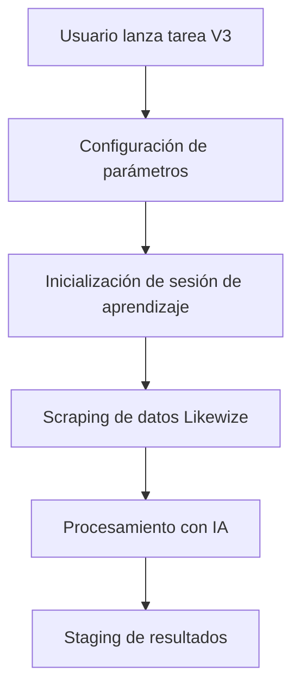
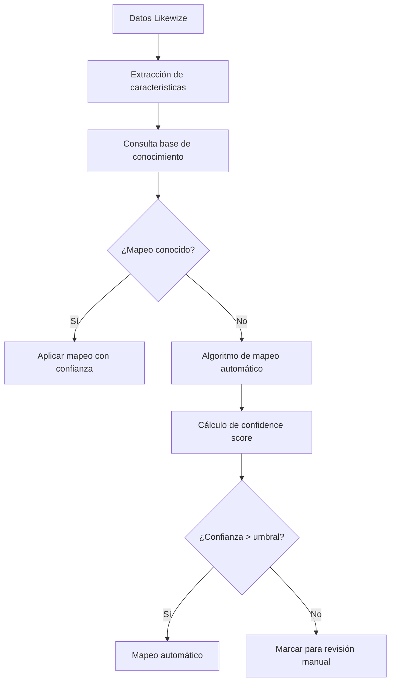
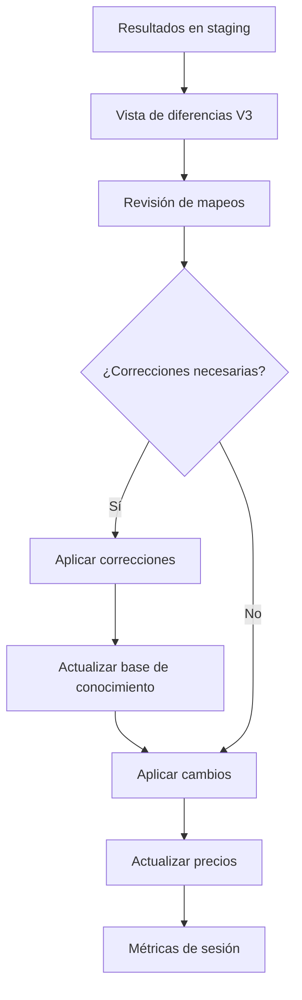

# Sistema de Auto-aprendizaje Likewize V3

## Descripción General

El sistema V3 es una evolución del sistema de actualización de precios Likewize que incorpora capacidades de auto-aprendizaje e inteligencia artificial para mejorar el mapeo entre modelos externos (Likewize) y la base de datos interna.

## Características Principales

### 🧠 Auto-aprendizaje Inteligente
- **Base de conocimiento**: Almacena patrones de mapeo exitosos
- **Confidence scoring**: Evalúa la confianza en cada mapeo automático
- **Retroalimentación**: Aprende de correcciones manuales del usuario
- **Métricas de rendimiento**: Tracking detallado de la efectividad del sistema

### 🔄 Procesamiento Mejorado
- **Mapeo automático**: Identifica automáticamente correspondencias modelo-capacidad
- **Validación inteligente**: Detecta inconsistencias y conflictos
- **Procesamiento incremental**: Solo procesa cambios desde la última ejecución
- **Staging inteligente**: Preparación de datos con validación previa

### 📊 Visibilidad y Control
- **Comparación detallada**: Vista lado a lado de modelos Likewize vs BD interna
- **Aplicación selectiva**: Permite aplicar cambios por lotes o individualmente
- **Métricas en tiempo real**: Dashboard con estadísticas de aprendizaje
- **Auditoría completa**: Registro detallado de todas las operaciones

## Arquitectura del Sistema

### Backend (Django)

#### Modelos Principales

**LikewizeKnowledgeBase**
```python
class LikewizeKnowledgeBase(models.Model):
    # Datos del modelo externo (Likewize)
    external_model_name = models.CharField(max_length=255)
    external_brand = models.CharField(max_length=100)
    external_type = models.CharField(max_length=100)

    # Mapeo a modelo local
    local_modelo = models.ForeignKey('Modelo')
    local_capacidad = models.ForeignKey('Capacidad')

    # Métricas de aprendizaje
    confidence_score = models.FloatField(default=0.0)
    success_rate = models.FloatField(default=0.0)
    user_validated = models.BooleanField(default=False)

    # Metadatos
    pattern_features = models.JSONField(default=dict)
    learning_session = models.ForeignKey('LearningSession')
```

**MappingCorrection**
```python
class MappingCorrection(models.Model):
    # Referencia al mapeo original
    original_mapping = models.ForeignKey('LikewizeKnowledgeBase')

    # Corrección aplicada
    corrected_modelo = models.ForeignKey('Modelo')
    corrected_capacidad = models.ForeignKey('Capacidad')

    # Contexto de la corrección
    correction_reason = models.TextField()
    applied_by = models.ForeignKey(User)
    confidence_impact = models.FloatField()
```

**LearningSession**
```python
class LearningSession(models.Model):
    # Identificación de la sesión
    session_id = models.UUIDField(default=uuid.uuid4)
    tarea_actualizacion = models.ForeignKey('TareaActualizacionLikewize')

    # Métricas de la sesión
    total_items_processed = models.IntegerField(default=0)
    successful_mappings = models.IntegerField(default=0)
    failed_mappings = models.IntegerField(default=0)
    avg_confidence = models.FloatField(default=0.0)

    # Configuración utilizada
    learning_enabled = models.BooleanField(default=True)
    confidence_threshold = models.FloatField(default=0.7)
```

#### Servicios Core

**DeviceMappingV2Service**
```python
class DeviceMappingV2Service:
    def __init__(self, learning_enabled=True, confidence_threshold=0.7):
        self.learning_enabled = learning_enabled
        self.confidence_threshold = confidence_threshold
        self.knowledge_base = LikewizeKnowledgeBase.objects

    def map_device(self, external_data):
        """Mapea un dispositivo externo a modelo/capacidad interno"""

    def learn_from_correction(self, correction_data):
        """Aprende de una corrección manual"""

    def get_mapping_confidence(self, mapping):
        """Calcula confidence score para un mapeo"""

    def update_knowledge_base(self, successful_mappings):
        """Actualiza la base de conocimiento"""
```

#### Endpoints API

**Lanzamiento de Actualización V3**
```
POST /api/likewize/v3/actualizar/
```
```json
{
  "categories": ["iPhone", "Samsung"],
  "enable_learning": true,
  "confidence_threshold": 0.7,
  "parallel_requests": 3
}
```

**Métricas de Aprendizaje**
```
GET /api/likewize/v3/metrics/
GET /api/likewize/v3/metrics/{tarea_id}/
```

**Estadísticas de Base de Conocimiento**
```
GET /api/likewize/v3/knowledge-base/stats/
```

**Revisión de Mapeos**
```
GET /api/likewize/v3/review/?confidence=0.6&limit=50
POST /api/likewize/v3/review/
```

**Diferencias V3**
```
GET /api/likewize/v3/tareas/{tarea_id}/diff/
```

**Aplicar Cambios V3**
```
POST /api/likewize/v3/tareas/{tarea_id}/aplicar/
```

### Frontend (React/TypeScript)

#### Hooks Principales

**useLearningMetrics**
```typescript
export function useLearningMetrics(refreshKey?: number) {
  return useQuery({
    queryKey: [LEARNING_KEYS.metrics, refreshKey],
    queryFn: async (): Promise<LearningMetrics> => {
      const response = await api.get('/api/likewize/v3/metrics/')
      return response.data
    },
    staleTime: 30000,
    refetchInterval: 60000,
  })
}
```

**useReviewMappings**
```typescript
export function useReviewMappings(params: { confidence?: number; limit?: number }) {
  return useQuery({
    queryKey: [LEARNING_KEYS.reviewMappings, params],
    queryFn: async (): Promise<ReviewMappingData> => {
      // Obtiene mapeos que requieren revisión manual
    },
    staleTime: 30000,
  })
}
```

**useApplyCorrections**
```typescript
export function useApplyCorrections() {
  const queryClient = useQueryClient()

  return useMutation({
    mutationFn: async (corrections: ReviewMappingRequest) => {
      // Aplica correcciones y actualiza base de conocimiento
    },
    onSuccess: () => {
      // Invalida caché relevante
    },
  })
}
```

#### Componentes UI

**EnhancedLikewizePage**
- Vista principal del sistema V3
- Detección automática de tareas V3 vs V1
- Interfaz unificada para ambas versiones
- Métricas en tiempo real

**MappingAuditPanel**
- Panel de auditoría de mapeos
- Lista de mapeos con baja confianza
- Interfaz de corrección manual
- Retroalimentación al sistema de aprendizaje

**DeviceMappingStrategy**
- Configuración de estrategias de mapeo
- Ajuste de umbrales de confianza
- Selección de algoritmos de mapeo
- Monitoreo de rendimiento

## Flujo de Trabajo V3

### 1. Lanzamiento de Tarea


### 2. Procesamiento Inteligente


### 3. Revisión y Aplicación


## Métricas y Monitoreo

### Métricas de Aprendizaje

**Confidence Statistics**
```json
{
  "avg_confidence": 0.85,
  "high_confidence_entries": 150,
  "medium_confidence_entries": 45,
  "low_confidence_entries": 12
}
```

**Learning Metrics**
```json
{
  "total_learned": 207,
  "avg_accuracy": 0.92,
  "improvement_rate": 0.15,
  "total_processing_time": 1250.5
}
```

**System Health**
```json
{
  "score": 88,
  "status": "healthy",
  "recommendations": [
    "Revisar mapeos con confianza < 0.6",
    "Actualizar patrones de Samsung Galaxy"
  ]
}
```

### Dashboard de Métricas

**KPIs Principales**
- Tasa de mapeo automático exitoso
- Tiempo promedio de procesamiento
- Precisión de predicciones
- Cobertura de base de conocimiento

**Trending Analysis**
- Evolución de confianza por semana
- Rendimiento por marca/modelo
- Impacto de correcciones en precisión

## Configuración y Despliegue

### Variables de Entorno

```bash
# Configuración V3
LIKEWIZE_V3_ENABLED=true
LIKEWIZE_V3_CONFIDENCE_THRESHOLD=0.7
LIKEWIZE_V3_LEARNING_ENABLED=true
LIKEWIZE_V3_MAX_PARALLEL_REQUESTS=3

# Configuración de IA
AI_MODEL_PATH=/path/to/models/
AI_CONFIDENCE_MIN=0.5
AI_BATCH_SIZE=100
```

### Migraciones de Base de Datos

```bash
# Aplicar migraciones V3
python manage.py migrate productos 0021_mappingsessionreport_appledeviceknowledgebase_and_more

# Popular base de conocimiento inicial
python manage.py populate_apple_knowledge_base

# Optimizar índices
python manage.py migrate productos 0020_optimize_device_mapping_indexes
```

### Comandos de Gestión

```bash
# Lanzar actualización V3
python manage.py actualizar_likewize_optimizado --enable-learning --confidence-threshold=0.7

# Monitorear mapeo de dispositivos
python manage.py device_mapping_monitor --real-time

# Gestionar caché de mapeos
python manage.py manage_device_mapping_cache --cleanup --optimize

# Probar sistema de mapeo V2
python manage.py test_mapping_v2 --sample-size=100
```

## Mejores Prácticas

### Para Administradores

1. **Monitoreo Regular**
   - Revisar métricas semanalmente
   - Ajustar umbrales según rendimiento
   - Validar mapeos de baja confianza

2. **Mantenimiento de Base de Conocimiento**
   - Limpiar entradas obsoletas mensualmente
   - Exportar datos para backup
   - Revisar patrones de aprendizaje

3. **Optimización de Rendimiento**
   - Ajustar paralelismo según carga
   - Monitorear uso de memoria
   - Optimizar consultas frecuentes

### Para Usuarios

1. **Revisión de Mapeos**
   - Priorizar mapeos con confianza < 0.6
   - Proporcionar retroalimentación detallada
   - Validar correcciones antes de aplicar

2. **Aplicación de Cambios**
   - Revisar diferencias antes de aplicar
   - Aplicar cambios en lotes pequeños
   - Monitorear impacto en precios

## Troubleshooting

### Problemas Comunes

**Error: "App 'productos' doesn't have a 'PrecioB2B' model"**
- **Causa**: Referencia a modelo incorrecto
- **Solución**: El sistema usa `PrecioRecompra` con canal='B2B'

**Error: "Cannot resolve keyword 'confidence_score'"**
- **Causa**: Campo no existe en el modelo
- **Solución**: Verificar migraciones aplicadas correctamente

**Frontend: "Cannot read properties of undefined (reading 'total')"**
- **Causa**: Estructura de respuesta API incompatible
- **Solución**: Verificar formato de respuesta en endpoints V3

### Logs de Diagnóstico

```bash
# Logs de aprendizaje
tail -f logs/learning_v3.log

# Logs de mapeo
tail -f logs/device_mapping.log

# Logs de tareas
tail -f logs/celery_worker.log
```

## Roadmap Futuro

### Fase 1 (Actual)
- ✅ Base de conocimiento operativa
- ✅ Mapeo automático con IA
- ✅ Interface de revisión manual
- ✅ Métricas básicas

### Fase 2 (Q2 2025)
- 🔄 Machine Learning avanzado
- 🔄 API externa para partners
- 🔄 Integración con más proveedores

### Fase 3 (Q3 2025)
- 📋 Mapeo predictivo
- 📋 Optimización automática de precios
- 📋 Análisis de tendencias de mercado
- 📋 Alertas inteligentes

## Soporte y Contacto

Para soporte técnico o consultas sobre el sistema V3:
- **Documentación técnica**: Ver archivos en `productos/services/`
- **Tests**: Ejecutar `python manage.py test_mapping_v2`
- **Monitoreo**: Usar `python manage.py device_mapping_monitor`

---

*Documentación generada el 30 de septiembre de 2025*
*Versión del sistema: V3.1.0*